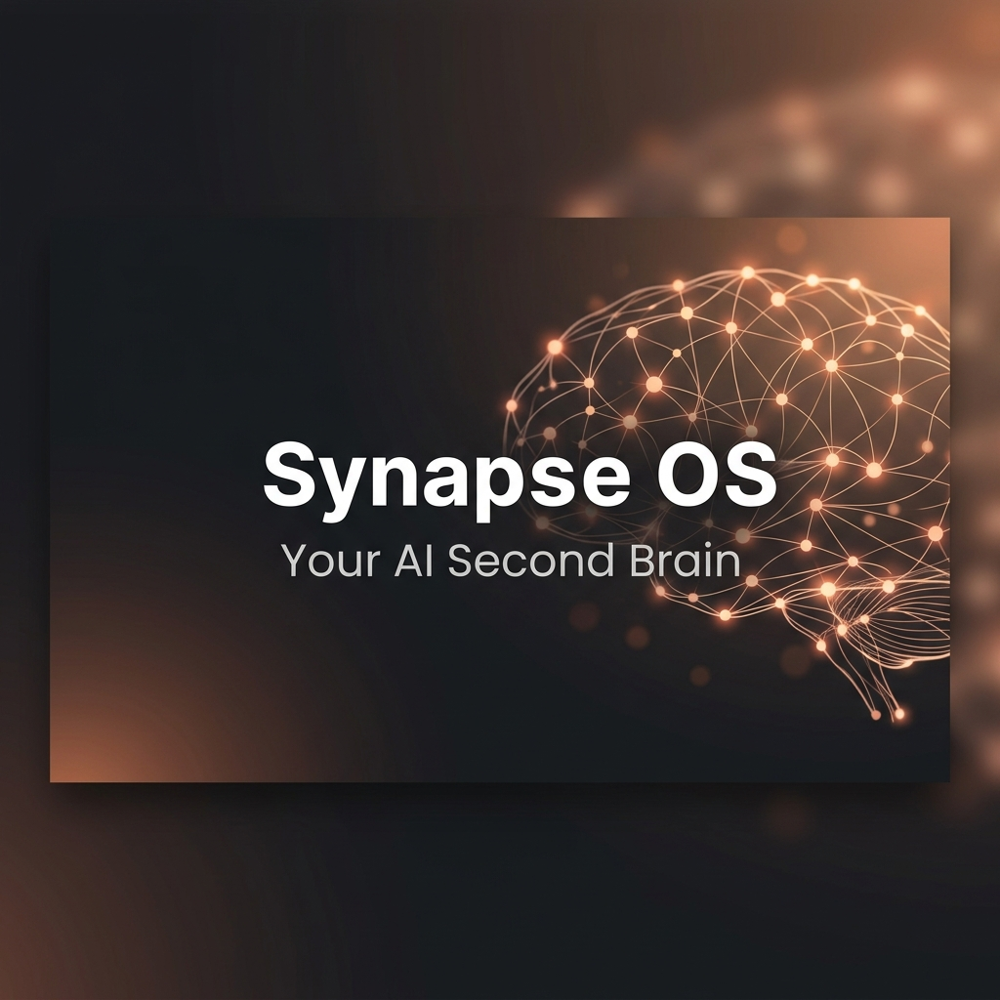
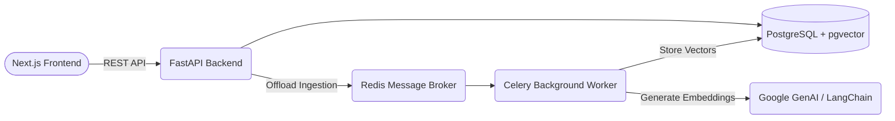

<div align="center">
  

  <h1>🧠 Synapse OS</h1>
  <p><strong>Your AI-Powered Second Brain & Next-Gen Knowledge Engine</strong></p>
  
  <p>
    <a href="https://react.dev/"></a>
    <a href="https://fastapi.tiangolo.com/"></a>
    <a href="https://www.postgresql.org/"></a>
    <a href="https://redis.io/"></a>
    <a href="https://docker.com/"></a>
  </p>
  
  <p>
    <em>A highly scalable, beautifully designed workspace that integrates deeply with Artificial Intelligence to transform static notes into dynamic knowledge.</em>
  </p>
</div>

---

## 🌟 Why Synapse OS?

Rather than acting as a simple, static note-taking app, Synapse functions as a dynamic knowledge engine. It actively ingests user documents into a high-dimensional **pgvector database**, utilizing a decoupled **Celery/Redis background worker architecture**. This ensures your interface remains lightning-fast, while heavy AI workloads run silently in the background.

With Synapse OS, you don't just store information—you interact with it.

---

## ✨ Core Features

- ⚡ **Lightning Fast Interface**: Built on Next.js with a warm, minimalist glassmorphic design system. No bloat, pure speed.
- 🧠 **Retrieval-Augmented Generation (RAG)**: Chat directly with your documents. Find answers buried deep in your notes instantly.
- 🧵 **Decoupled AI Processing**: Document chunking and embedding generation are offloaded to background workers. Your UI never freezes.
- 🔌 **Seamless Integrations**: Sync your GitHub repos, YouTube transcripts, Outlook emails, and local PDFs directly into your AI brain.
- 🐳 **One-Click Deploy**: The entire distributed architecture is containerized and orchestrated via Docker Compose.

---

## 🏗️ System Architecture

Synapse OS was built to demonstrate proficiency in System Design, Asynchronous Processing, and Modern Full-Stack Engineering.



### Technical Highlights (For Engineers)
- **Advanced Vector Search**: Natively uses **pgvector** within PostgreSQL for high-performance semantic similarity search (Cosine Distance), unifying relational and vector data.
- **Isolated Transactional Testing**: Pytest suite uses nested SQL transactions that rollback on teardown, guaranteeing a deterministic test environment.
- **Strict Schema Management**: Managed by **Alembic**, adhering to production-grade DB standards.

---

## 🚀 Quick Start (Docker)

Ready to spin up your own second brain? It takes less than 5 minutes.

> **Prerequisite:** Ensure you have [Docker Desktop](https://www.docker.com/products/docker-desktop/) installed and running.

1. **Clone the repository:**
   ```bash
   git clone https://github.com/SPE3DWAG0N/Synapse-OS.git
   cd Synapse-OS
   ```

2. **Configure Environment Variables:**
   Create a `.env` file in the `backend/` directory and add your LLM API key:
   ```env
   GOOGLE_API_KEY=your_gemini_key_here
   ```

3. **Spin up the distributed system:**
   ```bash
   docker-compose up --build
   ```

4. **Access the application:**
   - 🌐 **Frontend UI**: [http://localhost:3000](http://localhost:3000)
   - ⚙️ **Backend API Docs (Swagger)**: [http://localhost:8000/docs](http://localhost:8000/docs)

---

## 🧪 Development & Testing

Want to contribute or run tests? We have a rigorous integration testing suite.

```bash
cd backend
python -m venv venv
# Windows
.\venv\Scripts\activate  
# macOS/Linux
source venv/bin/activate

pip install -r requirements.txt
pytest tests/
```

---

<div align="center">
  <p>Built with ❤️ by passionate engineers.</p>
  <p>Released under the <a href="LICENSE">MIT License</a>.</p>
</div>
